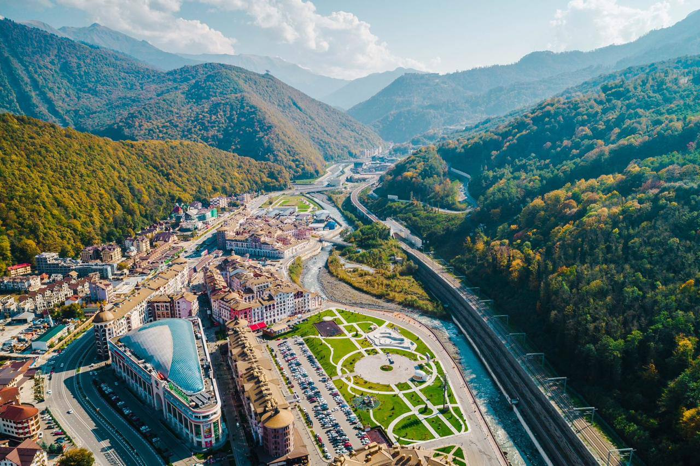

# Scammer 

>Level: Medium 
> 
>In the last message received by our analysts, a troubling name was mentioned — kubaneagle2000. This alias became the key to the mystery our intelligence team is trying to solve. Accused of revealing corporate secrets, kubaneagle2000 remains an enigma. For now, the trail only leads to this codename, but we believe that soon this virtual scammer will be exposed. We await your successful achievements and hope you can unravel this complex chain of events. 

## About the Task

This is a simple task of searching for a nickname online, which smoothly transitions into a steganographic puzzle (searching for hidden information in an image).  
## How to Solve 

The very first thing that comes to mind in such tasks is to search for the nickname "kubaneagie2000." We can use standard tools for this, like the command: 

```Shell
sherlock kubaneagie2000
````

or any web application for nickname search, for example, [https://namecheckup.com/](https://namecheckup.com/) or [https://whatsmyname.app/](https://whatsmyname.app/)

```Shell
# Sherlock output 
[+] GitHub: https://www.github.com/kubaneagle2000 
# ... 
[+] VK: https://vk.com/kubaneagle2000 
# ...
```

The most interesting results for us, as usual, are from GitHub and social networks popular in Russia - VK.

In kubaneagle2000's GitHub profile, we find one repository [hello-world](https://github.com/kubaneagle2000/hello-world). Let's check the commit history, the very first commit provides us with important information:

```Shell
steghide embed -cf 346947819847550.jpeg -ef flag.txt -p "KubanAaglesFlyHigh"
```

Using the command-line utility `steghide`, we can extract the flag from the image by using the passphrase `KubanAaglesFlyHigh`. All that remains is to find this image.

In our case, the hint for the necessary image was in VK: [https://vk.com/kubaneagle2000](https://vk.com/kubaneagle2000) The first and only post from this user contains an important link for us:

> Can anyone help me? Why the fuck can't I upload this picture here???
> 
> [https://ibb.co/hfB00QT](https://vk.com/away.php?to=https%3A%2F%2Fibb.co%2FhfB00QT&post=828710447_2&cc_key=&track_code=)

Following the link, we see a picture:



Google Lens tells us that this is Krasnaya Polyana in Sochi, Russia, but that’s not very important to us. We need to download the photo and check if the flag is hidden in it.

Now, we execute the previously found command on the located photo:

```Shell
steghide extract -sf 346947819847550.jpg -p "KubanEaglesFlyHigh"
```
We receive a notification `wrote extracted data to "flag.txt"`

A file called `flag.txt` appears in our working directory, and we just need to check its content using `cat flag.txt` to get the coveted flag:

```Shell
CSC{A_L177L3_B17_0S1N7_4_L177L3_B17_D1FF3R3N7}
```