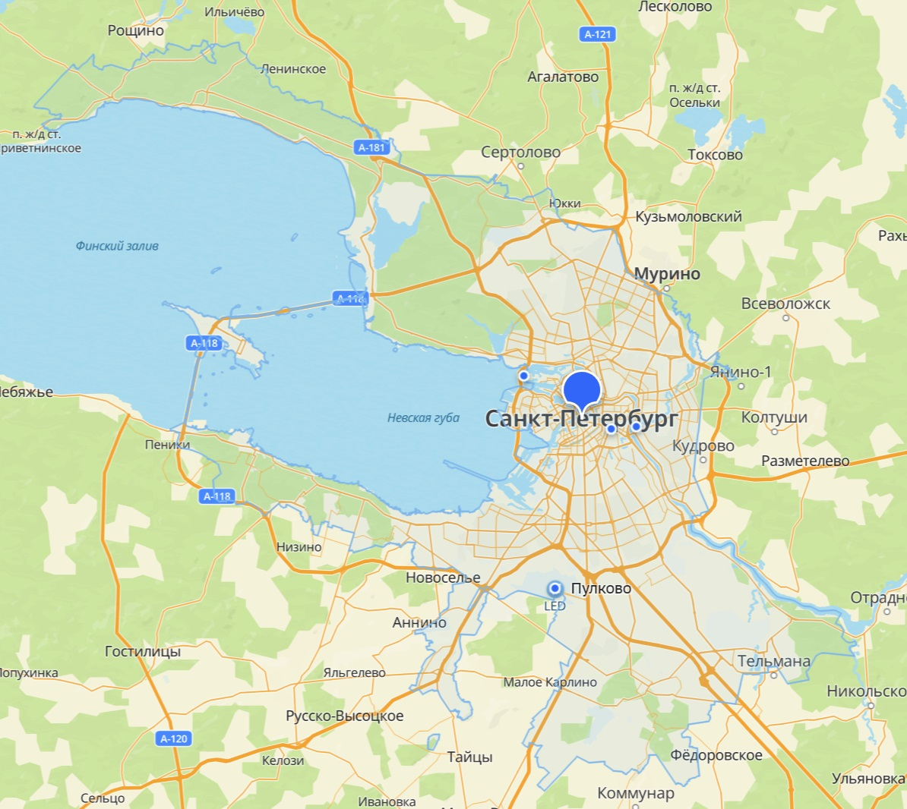
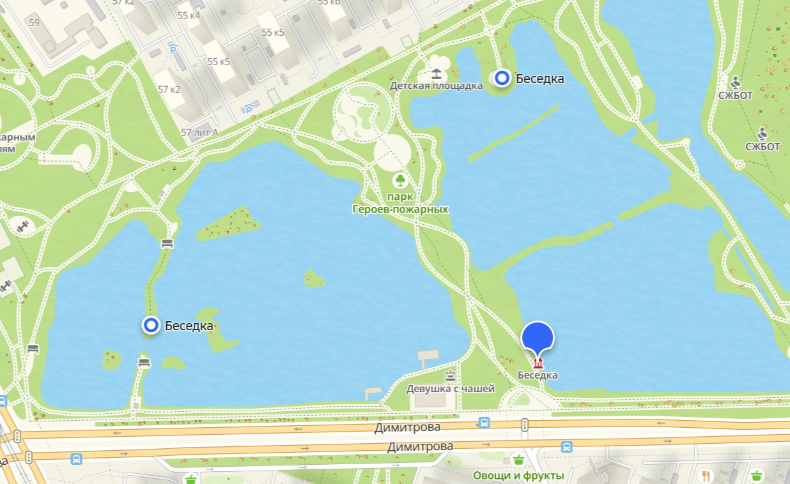
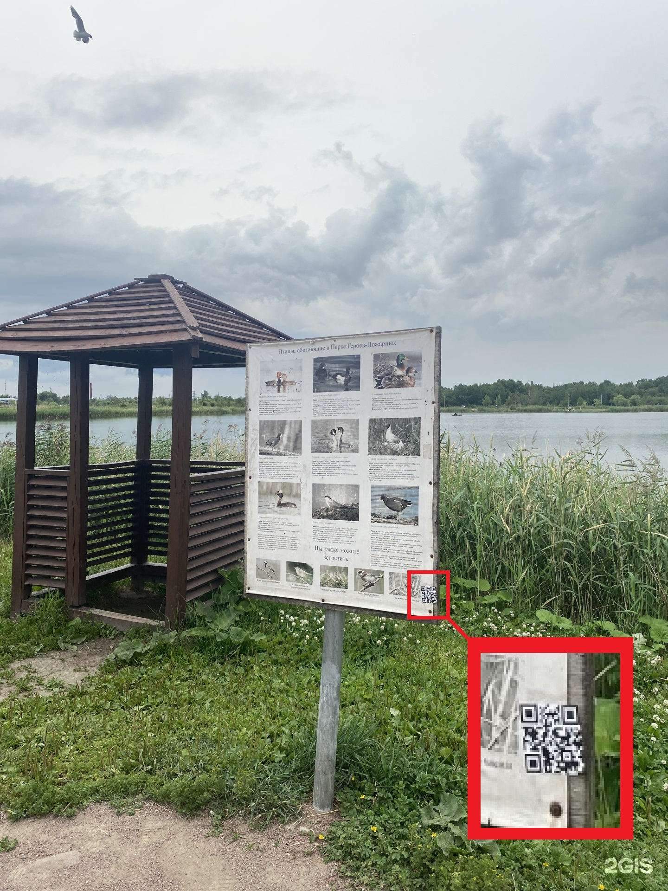

# Незаконная реклама
---

>Нелегальная реклама 
>
>Уровень: Лёгкий 
>
>Недавно в Санкт-Петербурге у какого-то карьера был замечен человек, который распространял возможно нелегальную рекламу путем расклеивания листовок. Одна из них каким-то образом попала в отзывы популярного справочника с картами городов. Твоя задача: найти место, где была наклеена листовка и выяснить, что он рекламирует

## Про задание
---
В данном задании нам нужно найти карьеры в пределах города Санкт-Петербурга, Россия. И поискать недалеко от них возможные места размещения рекламы. 

## Как решить
---
В описании задания говорится про "отзывы популярного справочника", самый популярный российский онлайн-справочник это 2gis.ru, на нем и будем искать.

Очень важно, что карьеры расположены **в пределах самого города**, поэтому в 2gis, нужно нажать на само название "Санкт-Петербург", тогда сайт покажет слабой голубоватой линией границы города. Вокруг Петербурга много других карьеров, а сам 2gis любит предлагать места поблизости даже за пределами вашей области поиска (карьеры из области), поэтому нам важно не выходить за эту линию во время поиска. 



Далее в поиске вводим "карьер" и пытаемся найти нужный, одновременно просматривая отзывы и прикрепленные к ним фото.

Я просмотрел около 15 вариантов выдачи, самыми релевантными показались:

- Ивановский карьер
- Шуваловский карьер
- Орловский карьер

Но ни в одном из них не было отзыва с фото "незаконной рекламы".

Задание за 6 часов так никто не смог решить, поэтому организаторы добавили подсказку:

>Подсказка 1
>
>Прямо сейчас нам поступила информация о том, что подозреваемый наклеил какой-то QR-код около беседки, которая располагается около водоема. 

Эта подсказка навела меня на некоторые мысли, что если нужный нам "карьер" не обозначается на карте 2gis именно как карьер, хоть таковым и является. Поэтому я стал просматривать наиболее крупные водоемы, которые видны на карте Петербурга. 

Мой взгляд быстро привлек Парк Героев-Пожарных, в котором были водоемы по всем признакам напоминающие небольшие "карьеры". Я загуглил информацию о них, и действительно, тут ранее были глинянные карьеры Бывшего кирпичного завода, сейчас же они, скорее, считаются прудами. 

Также в подсказке, нам дали очень важные сведения: реклама наклеена около **беседки**. А 2gis очень кстати показывает даже беседки у себя на карте. 



В пределах ранее выделенных релевантных карьеров и дополнительно прудов Парка Героев-Пожарных я просмотрел все беседки (к ним также оставляли отзывы).

И нужная беседка быстро нашлась: https://2gis.ru/spb/search/%D0%B1%D0%B5%D1%81%D0%B5%D0%B4%D0%BA%D0%B0/geo/70030076429075570?m=30.408271%2C59.853555%2F16.13

В отзывах к ней была фотография, с прикрепленным qr-кодом к плакату с объявлениями:


Отсканировав данный QR-код мы получаем заветный флаг:

```
CSC{th1s_is_ill3gal_4dvert1sing}
```
